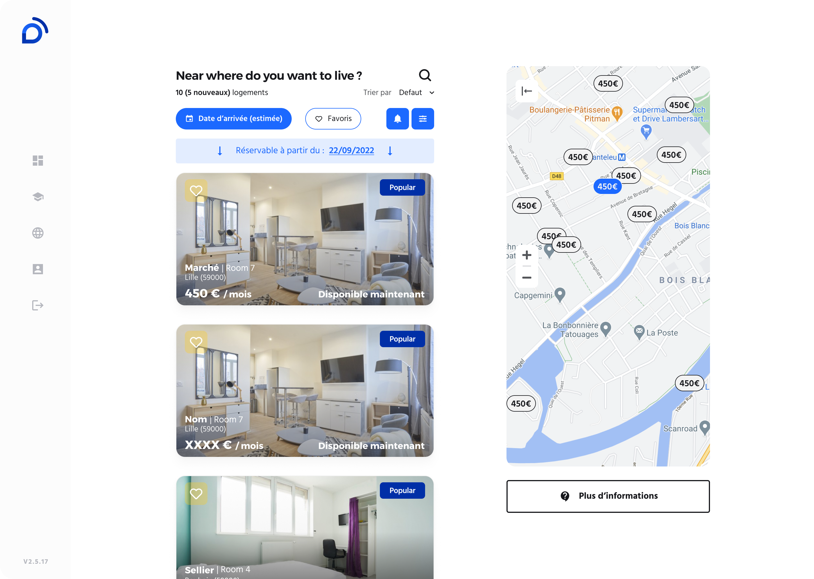

# Recherche et réservation de logement étudiant

Tags: B2C, Desktop, LivinFrance, Mobile
Lien: livin-france.com/accommodation/list
Homepage: Yes

En tant que seul designer produit chez LivinFrance, j'ai identifié que notre parcours de réservation de logement perdait la majorité de nos utilisateurs avant la conversion, un problème direct sur notre capacité à générer du revenu récurrent.

**J'ai commencé par collecter les données** du funnel existant (les seules données disponibles à l'époque), qui ont révélé un **manque de confiance** franc chez nos utilisateurs :

> Liste des logements → Fiche du logement → Détail des paiements → Formulaire de réservation
> 

50% des utilisateurs abandonnaient entre l'explication des échéances de paiement et le formulaire d'informations personnelles complété, puis 90% supplémentaires après le paiement lui-même.

**Pour comprendre ce qui bloquait précisément**, j'ai missionné l'équipe support client pour interroger nos utilisateurs et faire remonter les points de friction du parcours.

Nos utilisateurs hésitaient face à la page détaillant l'ensemble des échéances de paiement, submergés par leur nombre. J'ai choisi de conserver cette transparence plutôt que de la supprimer. La masquer aurait réduit l'abandon à court terme, mais aurait recréé le problème de confiance plus loin dans le parcours, au moment des futurs paiements. J'ai donc restructuré l'affichage pour indiquer uniquement les étapes restantes avant la réservation, plutôt que la totalité du calendrier de paiement d'un coup.

Le second problème, plus lourd, concernait le formulaire d'informations personnelles : la majorité des utilisateurs ne parvenaient pas à le compléter. En creusant, il est apparu que la plupart de ces champs n'étaient pas nécessaires à cette étape du parcours et leur nombre décourageait les utilisateurs au point que certains quittaient le funnel pour réserver chez un concurrent. 

J'ai réduit le formulaire de 8 à 3 champs en ne conservant que les informations réellement indispensables à ce stade, remplacé le sélecteur de calendrier par trois listes déroulantes, et supprimé les champs "Ville", "Code postal", "Région" et "Pays" qui sont trop spécifiques au format français au profit d'un seul champ d'adresse assisté par l'autocomplete Google, utilisable peu importe le format de l’adresse.

Le reste des ajustements a porté sur les informations que les utilisateurs demandaient systématiquement à notre support afin que le parcours n'ait plus besoin d'être expliqué.

**Résultat** : Les utilisateurs allaient significativement plus loin dans le funnel, jusqu'à la réservation effective, là où la majorité sortait auparavant avant même d'avoir complété leurs informations.

> Liste des logements → Fiche du logement → Explication des échéances → Demande d’information pour construire le dossier → Paiement
> 

#### Voir le parcours complet du produit *(ce funnel s'inscrit dans un flow plus large, dépliez pour voir l'ensemble du parcours de réservation tel qu'il fonctionnait à la fin du projet)*

---

<aside>
🔮

**Ce que je ferais différemment aujourd'hui**

Ce projet date de 2020-2023, et certains choix ne passeraient plus mes standards actuels :

- **Contraste des éléments flottants** : les boutons superposés aux photos (retour, partage, favoris) utilisaient un fond clair avec icônes blanches, insuffisant en accessibilité (ratio AA) et illisible sur les photos très lumineuses. Aujourd'hui, je systématiserais un scrim sombre semi-opaque derrière ces éléments, quel que soit le contenu en arrière-plan.
- **Cibles tactiles** : plusieurs zones cliquables (navigation secondaire, actions sur photo) étaient sous les 44×44px recommandés. Un point que j'intègre désormais par défaut dans mes specs.
</aside>