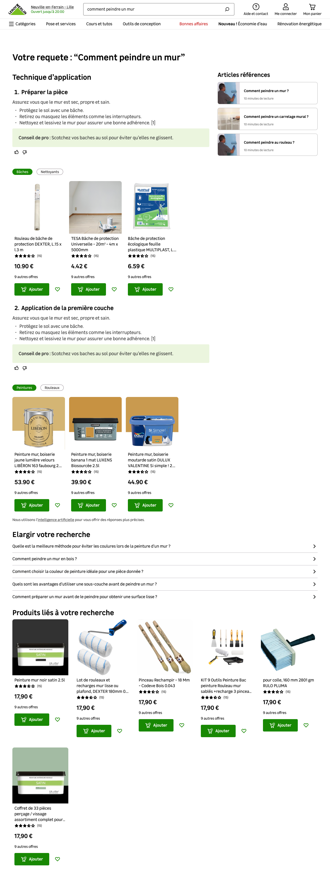
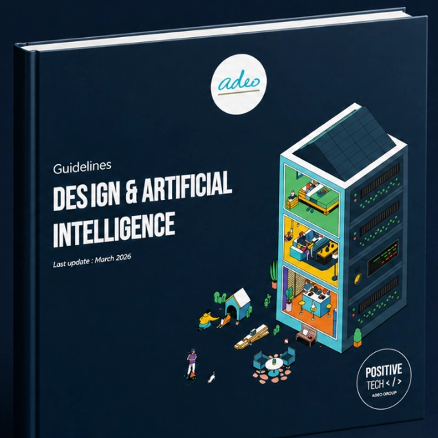

# Transformer le RAG Edito en standard AI UX pour tout ADEO

Tags: ADEO, AI, B2C, Desktop, Mobile
Lien: https://www.leroymerlin.fr/search?q=Comment+percer+un+mur+en+b%C3%A9ton+%3F
Homepage: Yes

TL;DR : Le Program AI avait identifié que près de 5 % des requêtes tapées dans la barre de recherche de [LeroyMerlin.fr](http://LeroyMerlin.fr) étaient des questions en langage naturel liées au bricolage. J'ai rejoint ce chantier pour concevoir le **RAG Edito**, une expérience qui transforme ces requêtes en réponses actionnables couplées aux bons produits. Ce travail est devenu le terrain d'apprentissage à partir duquel j'ai co-écrit les **guidelines AI UX du groupe**, puis accompagné leur application par d'autres designers, avec des résultats mesurables à l'échelle de la plateforme.

# Contexte

Avant même mon arrivée sur le sujet, le Program AI avait identifié une opportunité : près de **5 % des requêtes** tapées dans la barre de recherche de [LeroyMerlin.fr](http://LeroyMerlin.fr) étaient rédigées sous forme de questions de bricolage plutôt que de mots-clés produits. C’est là qu’est né le **RAG Edito** : un système capable de répondre à des questions en s'appuyant sur des articles éditoriaux du site, tout en recommandant les produits nécessaires pour réaliser des projets de bricolage.

J'ai conçu l'expérience éditoriale du produit : structurer chaque réponse en étapes actionnables, coupler chaque étape aux produits pertinents, sourcer chaque contenu vers l'article d'origine pour préserver la confiance de l'utilisateur plutôt que de générer une réponse opaque.

Ce travail s'est fait en collaboration quasi permanente avec le data engineer, qui a construit le knowledge graph et piloté le modèle (basé sur Gemini) derrière le produit. Cette proximité dépassait la simple spécification d'interface, nous avons travaillé ensemble sur :

- les **critères de pertinence** du knowledge graph,
- les **cas de fallback** quand aucune réponse fiable n'était disponible,
- et exploré différentes pistes de **génération d'interface côté utilisateur.**

La génération d’interface structure la réponse en créer un contenu personnalité qui s’adapte à la question plutôt que de suivre un template figé. C’est une piste que je continue de creuser en m'appuyant sur les travaux de **Dan Saffer** sur l'interaction design, et sur des projets de veille comme [UI for AI](https://uiforai.figma.site/), qui explorent les interfaces IA au-delà du prompt.

<aside>
📊

117 700 requêtes traitées par le RAG · 31 100 contenus affichés · 72,2 secondes de temps moyen sur page · CTR en progression continue depuis le lancement (valeur de départ non conservée)

</aside>

---

# Confronter le design à l'usage réel

Concevoir pour du génératif a aussi remis en question notre manière de designer et de tester.

- **Travailler avec l'ingénierie IA dès l'idéation**
Les étapes classiques « design puis développement » ne tiennent plus quand la technologie évolue aussi vite. C'est ce que la collaboration avec les data engineers a révélé en premier et c'est devenu un principe formalisé pour le reste de la plateforme.
- **Tester en environnement réel plutôt que sur maquette**
Un score SUS obtenu sur un mockup statique n'a que peu de valeur pour une expérience générative, par nature dynamique et imprévisible.

En juillet 2025, j'ai animé l'ensemble des sessions et mené l'analyse d'une campagne de tests utilisateurs sur les fonctionnalités génératives du site : 7 participants, sessions de 45 minutes en semi-directif, avec une consigne d'observation libre pour capter les comportements spontanés et les moments de doute face aux réponses générées.

En un an, la familiarité des Français avec l'IA générative était passée de 33 % à 88 % de notoriété, avec 74 % d'usage actif chez les 18-24 ans contre seulement 17 % chez les plus de 60 ans. Les attentes évoluaient plus vite que nos interfaces. Les utilisateurs arrivent avec le réflexe ChatGPT ou Perplexity, ils posent une question complète en langage naturel plutôt que des mots-clés, puis **cliquent systématiquement sur les références citées pour vérifier la réponse** et l'évaluent face à leur propre expérience.

> « Même ma mère, elle a compris qu'il fallait poser des questions en entier. Et maintenant, elle active la fonctionnalité vocale pour poser sa question. » - utilisateur, UTRG#7
> 

Cette étude a directement validé le choix de sourcer systématiquement chaque réponse vers l'article d'origine : une réponse mesurée à un comportement de vérification observé chez la quasi-totalité des participants. La synthèse a ensuite été mise en forme par **Paul Thanasack**, Head of UX AI & new technologies, qui en a tiré la conclusion stratégique pour la plateforme.

En décembre 2025, un second test utilisateur a eu lieu afin de suivre l’évolution de la compréhension de l’IA par nos clients et il a produit une moyenne de 85 en utilisant l’échelle System Usability Scale, montrant par la même occasion que l’utilisabilité va de paire avec les compétences de l'intelligence artificielle.

---

# En tirer des standards

Ce travail m'a confronté aux mêmes questions, encore et encore : comment présenter une réponse générée tout en étant transparent ? Comment gérer l'incertitude du modèle sans casser la confiance ? Comment éviter de transformer chaque interaction en conversation quand une simple suggestion suffit ?

Plutôt que de garder ces réponses pour ce seul produit, je les ai formalisées avec le Head of Design dans des **guidelines AI UX pour l'ensemble du groupe**, structurées autour de quatre principes : 

- une IA centrée sur le besoin réel plutôt que sur la démonstration technologique,
- une IA éthique et transparente sur son fonctionnement,
- une IA alignée avec les comportements existants plutôt qu'imposant de nouveaux patterns,
- et une IA disponible sans être intrusive.

Le tout dans l'esprit du Sentient Design de **Josh Clark** : proactive quand le contexte le justifie, sur demande le reste du temps. Le signal qui indique qu'une IA est à l'œuvre (ou son absence) est un sujet sur lequel **Luke Wroblewski** a beaucoup écrit, notamment sur la standardisation des icônes IA, une réflexion qui a directement nourri le pilier « éthique et transparent ».

---

# Accompagner leur application

Les guidelines seules ne suffisent pas. J'ai accompagné plusieurs designers dans leur application concrète : revues de design récurrentes, coaching sur des cas réels, notamment sur le Search Widget des fiches produit et le Virtual Assistant du site.

Le RAG Edito a depuis été transféré au designer attitré de la recherche. Ce qui, à mon sens, indique qu'un produit est arrivé à maturité : il n'a plus besoin de moi pour continuer à évoluer. Je suis resté référent transversal sur les standards AI UX du groupe.

<aside>
📈

Sur le Search Widget, le taux d'usage est passé de 0,16 % à 2,45 % après application des guidelines (**+1431 %**), avec un impact business estimé à **21,8 M€** de GMV annuel sur le web France.

</aside>

---

# Mon rôle

- Conception de l'expérience du RAG Edito (structure de réponse, sourcing, association produits)
- Collaboration continue avec l'ingénierie IA sur la pertinence, les fallbacks et la génération d'interface
- Animation et analyse des tests utilisateurs sur les fonctionnalités génératives
- Co-rédaction des guidelines AI UX du groupe
- Coaching et design reviews auprès des designers appliquant ces standards